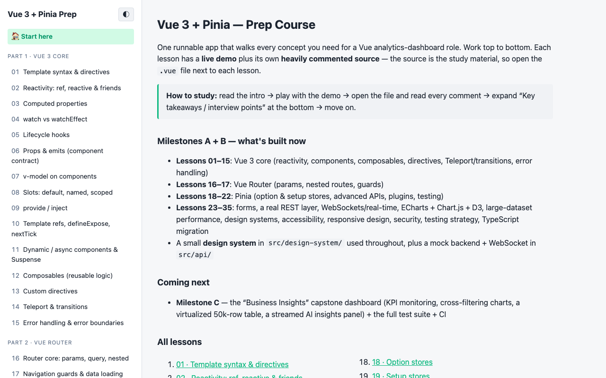
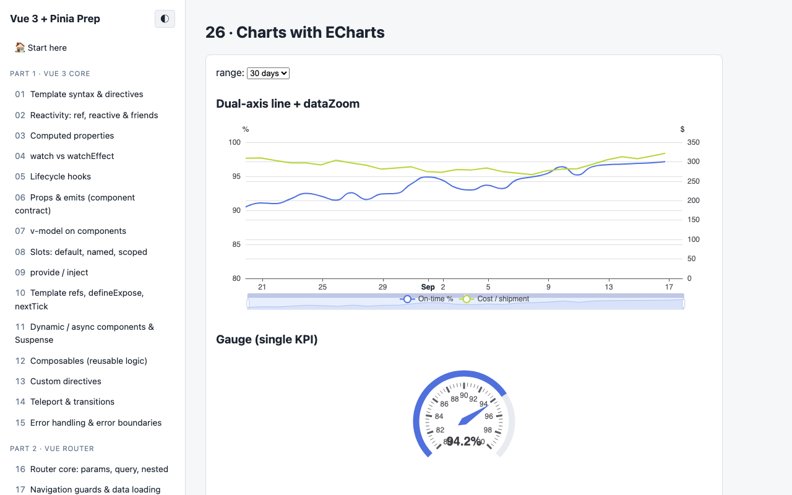
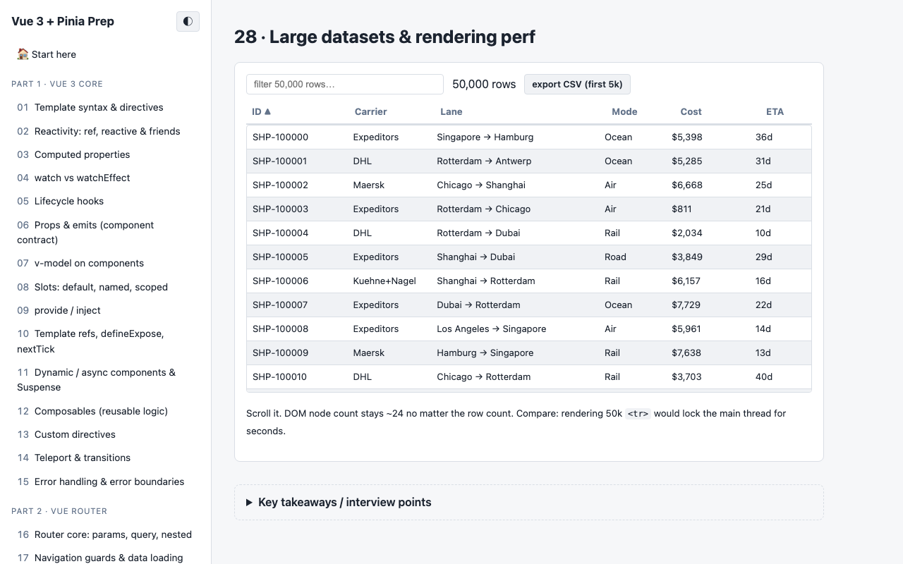
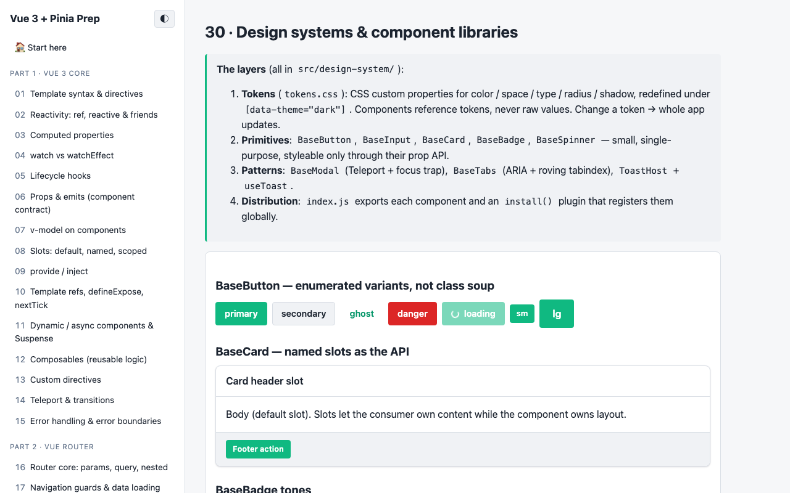
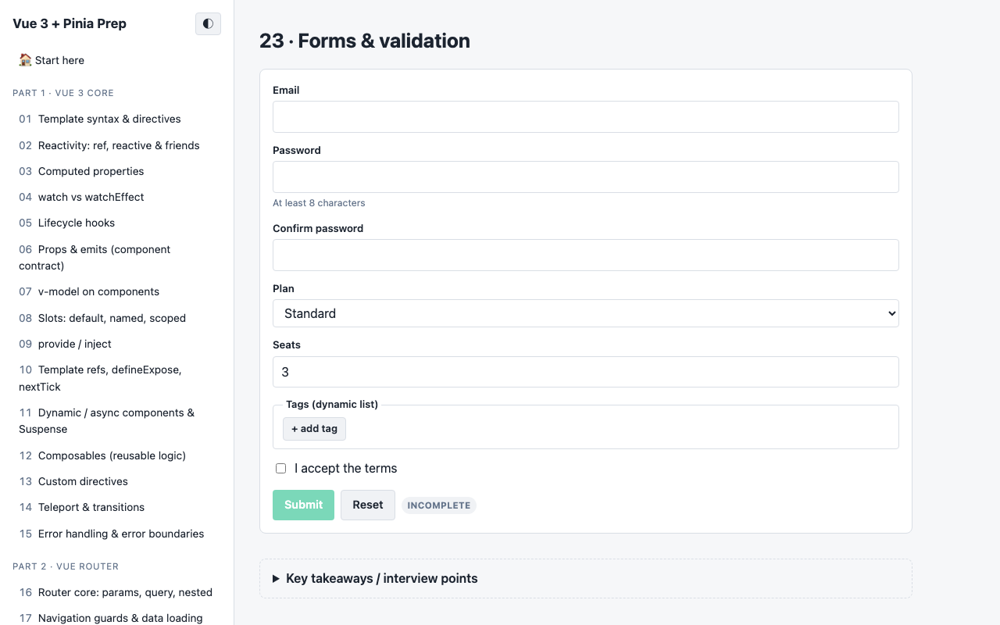
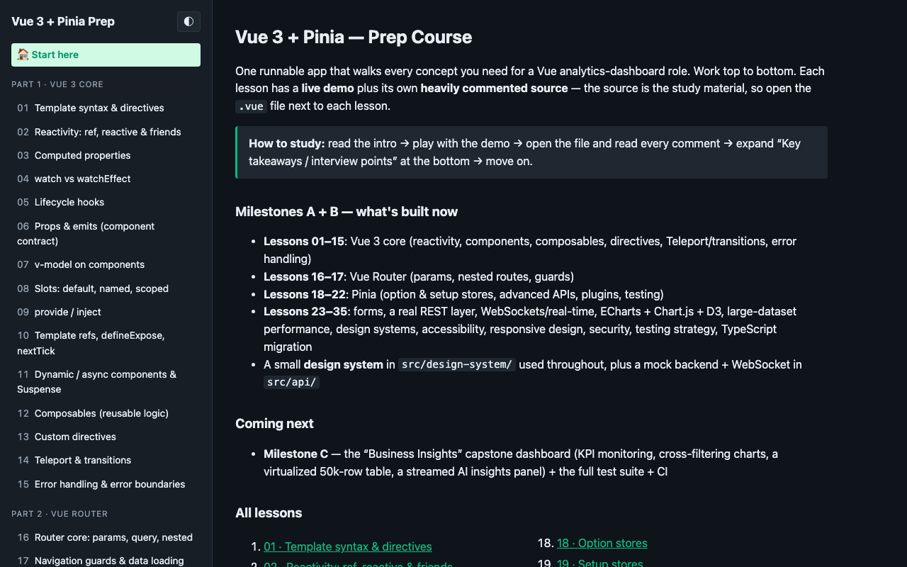

# Vue 3 + Pinia — Prep Course

A single runnable Vite app that teaches every concept needed for a **Vue analytics-dashboard
role**. Each lesson is a route with a live demo plus heavily commented source — **the source is
the study material**.

Target job: senior frontend building a "Business Insights" platform (Vue 3, JS/TS, Pinia,
REST + WebSocket, ECharts/Chart.js/D3, dashboards, design systems, accessibility, CI, perf).

---

## Screenshots

<table>
<tr>
<td width="50%">
<br>
<sub>Course overview — 35 lessons across Vue core, Router, Pinia, and the dashboard skill set</sub>
</td>
<td width="50%">
<br>
<sub>ECharts — dual-axis line chart with dataZoom + a live gauge</sub>
</td>
</tr>
<tr>
<td width="50%">
<br>
<sub>A virtualized table over 50,000 rows — ~24 DOM nodes, no matter the row count</sub>
</td>
<td width="50%">
<br>
<sub>The token-driven design system used throughout the app</sub>
</td>
</tr>
<tr>
<td width="50%">
<br>
<sub>Forms & validation with a hand-rolled <code>useForm</code> composable</sub>
</td>
<td width="50%">
<br>
<sub>Dark mode, token-driven throughout</sub>
</td>
</tr>
</table>

---

## Prerequisites

Node.js **20+** and npm. This repo was scaffolded and verified with **Node 20.20.2 / npm 10.8.2**,
installed via [nvm](https://github.com/nvm-sh/nvm) at `~/.nvm` (nvm was added to your `~/.zshrc`,
so a new terminal has `node`/`npm` on PATH). `.nvmrc` pins the version — run `nvm use` in the repo.

If you ever need to reinstall the toolchain:

```bash
export NVM_DIR="$HOME/.nvm" && [ -s "$NVM_DIR/nvm.sh" ] && . "$NVM_DIR/nvm.sh"
nvm install    # reads .nvmrc
```

## Run it

```bash
npm install
npm run dev
```

Open http://localhost:5173 and start at **“Start here”**.

### Verified status (Milestones A + B)

`npm run lint` → 0 errors (6 intentional a11y warnings) · `npm run test` → **31/31 pass** (8 files) ·
`npm run build` → OK, per-route code-splitting (the ECharts lesson is its own ~600 KB lazy chunk
by design — see lesson 26) · `npm audit` → 0 vulnerabilities. All 35 lesson routes loaded in a
browser with no console errors; forms, the REST layer + mock backend, WebSocket stream, ECharts /
Chart.js / D3 charts, and the 50k-row virtual table were exercised by hand.

| Command | What it does |
| --- | --- |
| `npm run dev` | Dev server with HMR |
| `npm run build` | Production build into `dist/` (watch the per-route chunks) |
| `npm run preview` | Serve the production build locally |
| `npm run test` | Run the Vitest suite once |
| `npm run test:watch` | Vitest in watch mode |
| `npm run coverage` | Test run + HTML coverage report |
| `npm run lint` | ESLint (includes Vue + accessibility rules) |
| `npm run format` | Prettier write |

---

## Suggested learning order

Work straight through the sidebar. Budget ~20–40 min per lesson: read the intro → play with the
demo → **open the `.vue`/`.js` file and read every comment** → expand “Key takeaways / interview
points” → move on.

### Milestone A ✅

- **01–05** reactivity & the render model: template syntax, `ref`/`reactive`, `computed`,
  `watch`/`watchEffect`, lifecycle
- **06–10** components: props/emits, `v-model`, slots, provide/inject, template refs
- **11–15** patterns: dynamic/async/`Suspense`, composables, custom directives,
  Teleport/transitions, error boundaries
- **16–17** Vue Router: params/query/nested, navigation guards + the unsaved-changes pattern
- **18–22** Pinia: option stores, setup stores, `storeToRefs`/`$patch`/`$subscribe`/`$onAction`,
  plugins & persistence, testing stores

### Milestone B ✅

- **23** forms & validation (all input types, modifiers, dynamic fields, a `useForm` composable)
- **24** a real REST layer — `http.js` (base URL, auth, error normalization, `AbortController`,
  retry + backoff) + `useFetch` (state machine, cancellation, cache) + a fetch-intercepting mock backend
- **25** WebSockets & near-real-time — `useWebSocket` (reconnect/backoff, visibility pause,
  bounded buffer), message batching
- **26** ECharts — wrapper lifecycle, tree-shaken import, `dataZoom`, efficient updates, theming
- **27** Chart.js wrapper + D3 custom SVG sparkline (D3 for math, Vue for DOM)
- **28** large datasets — a hand-rolled virtual list over **50,000 rows**, `shallowRef`, `v-memo`
- **29** performance toolkit — lazy-mount-on-scroll, `v-memo` demo, the full lever list
- **30** design systems — the tokens → primitives → patterns → distribution model
- **31** accessibility — an ARIA combobox with full keyboard support + the checklist
- **32** responsive design — CSS-first, `useMediaQuery`, container queries
- **33** secure frontend practices — live XSS / `v-html` demo, token storage, CSP/CSRF/CORS
- **34** testing strategy — the pyramid + recipes for stores/composables/async/WebSocket
- **35** TypeScript migration — the incremental plan + every Vue-specific type pattern

Also built across A + B: `src/design-system/` (token-driven component library), `src/composables/`
(12), `src/directives/`, `src/api/` (`http.js`, `mockBackend.js`, `ws.js`, `dataset.js`,
`fakeApi.js`), a GitHub Actions CI workflow, and a Vitest suite (`tests/`, 31 tests).

### Milestone C (next)

The **“Business Insights” capstone dashboard**: KPI monitoring, cross-filtering analytics, a
virtualized 50k-row shipments table, an AI-assisted insights panel with streamed responses, live
WebSocket updates, persisted settings — plus the full test suite.

---

## Job-description → where it's covered

| JD requirement | Lessons / files |
| --- | --- |
| Vue 3 Composition API, `<script setup>` | 01–15, every file |
| Reactivity, performance-aware (`shallowRef`, `v-memo`) | 02, 28, 29 |
| Reusable components / design system | `src/design-system/`, 30 |
| Pinia (or Vuex) — all patterns | 18–22 |
| Vue Router, guards, lazy routes | 16–17, `src/router/` |
| REST APIs | 24, `src/api/http.js`, `src/composables/useFetch.js` |
| WebSocket / near-real-time | 25, `src/composables/useWebSocket.js`; capstone (C) |
| Charts: ECharts / Chart.js / D3 | 26–27, `src/components/EChart.vue` etc.; capstone (C) |
| Analytics dashboards / KPI monitoring | capstone (C) |
| Large datasets / rendering efficiency | 28, `src/composables/useVirtualList.js`; capstone table (C) |
| Accessibility standards | 31, `BaseModal`/`BaseTabs`/`BaseInput` |
| Responsive design | 32, `App.vue` shell, `src/composables/useMediaQuery.js` |
| Forms, validation | 23, `src/composables/useForm.js` |
| JavaScript **and TypeScript** | JS throughout; 35 is the TS migration plan |
| Frontend testing | 22, 34, `tests/` (31 tests) |
| Git workflow / CI/CD | `.github/workflows/ci.yml`, section below |
| Secure frontend practices | 33 |
| Performance optimization | 28–29 |
| AI-assisted / conversational UI (nice-to-have) | capstone `InsightsView` (C) |

---

## Git workflow (what the JD means by "Git workflows / CI/CD")

```bash
git init && git add -A && git commit -m "chore: scaffold prep course"

# feature branches, small PRs
git checkout -b feat/echarts-lesson
# ... work ...
git commit -m "feat(lesson-26): ECharts responsive trend chart"
git push -u origin feat/echarts-lesson
# open a PR -> CI (.github/workflows/ci.yml) runs lint + test + build -> review -> squash-merge
```

Conventional Commits (`feat:`, `fix:`, `chore:`, `refactor:`, `test:`, `docs:`) keep history
readable and enable automated changelogs.

## Project layout

```
src/
  main.js            app bootstrap (createApp, pinia, router, design system, error handler)
  App.vue            sidebar shell + <RouterView>
  router/            route config + lesson manifest
  lessons/           one .vue per lesson — the course content
  design-system/     tokens.css + Base* components + useToast (a real mini component library)
  components/        shared demo children used by lessons
  composables/       useMouse, useLocalStorage, useDebouncedRef, useEventBus, ...
  directives/        v-autofocus, v-click-outside, v-tooltip
  stores/            counter (option), cart (setup), auth (persisted) + a logger plugin
  api/               http.js (fetch wrapper), mockBackend.js (fetch interceptor),
                     ws.js (mock socket), dataset.js (50k rows), fakeApi.js
tests/               Vitest specs — stores, composables (form/fetch/ws/virtual-list),
                     http.js, reactivity (31 tests)
```
